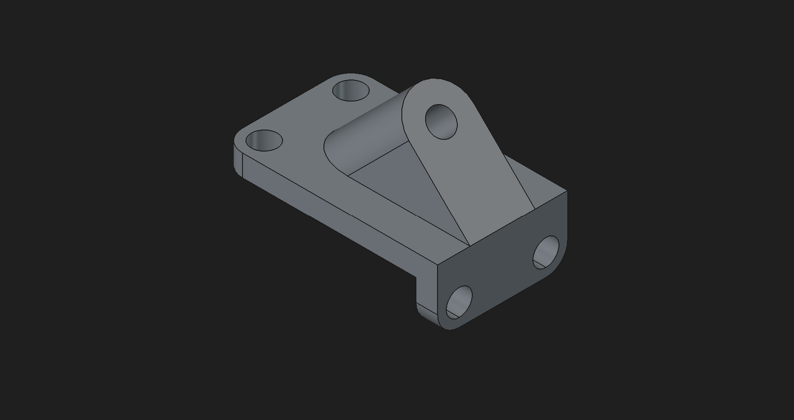
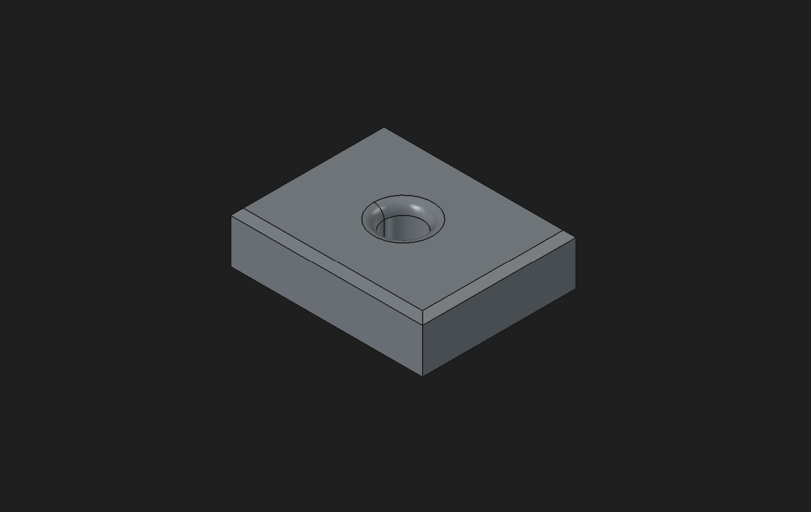
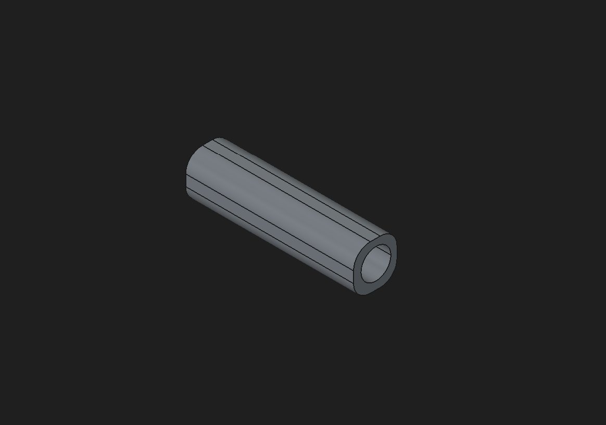
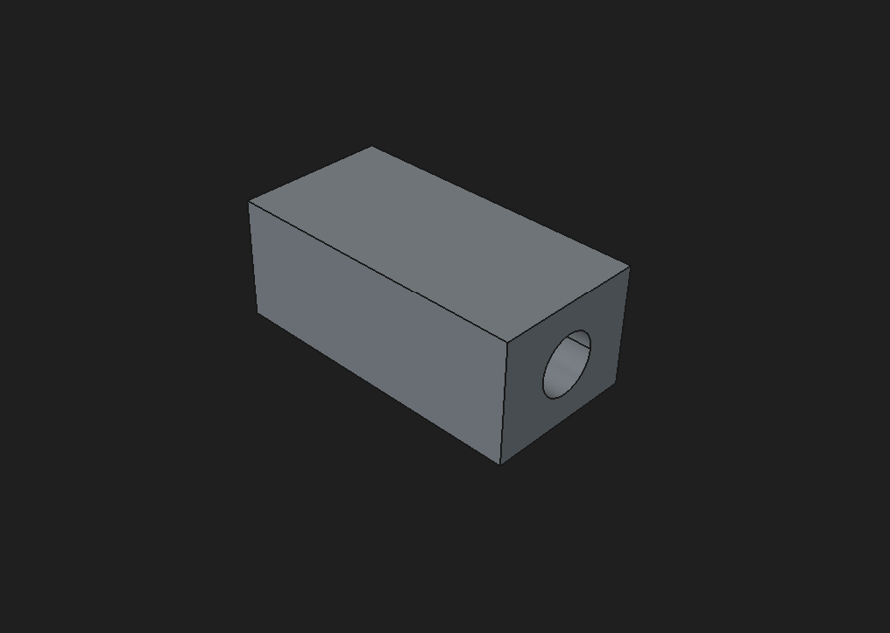

# FreeCAD Learning Portfolio

This repository contains my FreeCAD learning projects and mechanical design practice.

## Projects

### Mounting Bracket V1

A mechanical mounting bracket featuring:

- Two top mounting holes
- Two front mounting holes
- Reinforcing support rib
- Raised bracket arm
- Through-hole for pin or bolt connection

### Chamfered Plate
Practice project focused on:
- Chamfers
- Sketch constraints
- Part Design workflow
- 

A simple plate model featuring:

- Corner chamfers
- Sketch constraints
- Parametric dimensions

### Cylindrical Spacer
Practice project for:
- Pads
- Holes
- Dimensioning
- 

A cylindrical spacer component featuring:

- Central through-hole
- Parametric dimensions
- Basic pad and pocket operations

### Hole Block
Practice project for:
- Hole operations
- Sketch positioning
- Parametric design
- 

A rectangular block featuring:

- Through-holes
- Sketch positioning
- Dimensional constraints

## Software Used

- FreeCAD 1.1.1

## Author

Bariz
